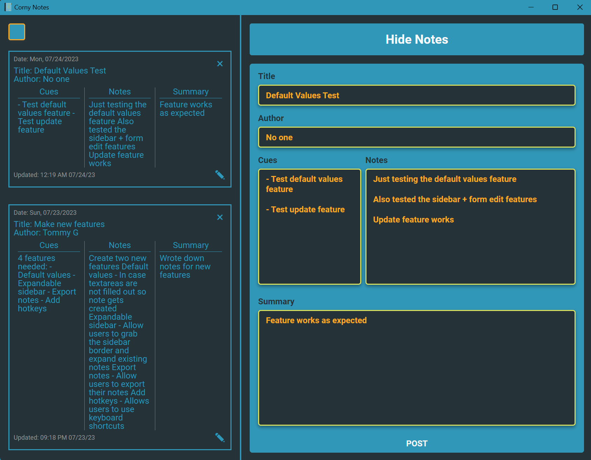

<h1 align="center">Corny Notes</h1>
<h3 align="center">Built with Electron, TypeScript, Sequelize, and SQLite</h3>



## 📚 Description

A simple, lightweight desktop application designed for efficient and intuitive note-taking.

While the primary objective of this project is to provide an easy-to-use platform for users to manage their notes, it also serves as a valuable learning tool. It deliberately incorporates a robust technology stack - Electron, TypeScript, Sequelize, SQLite - with the goal of deepening understanding and gaining hands-on experience with these technologies.

## 🛠️ Technologies

- **Electron**: For building the desktop application
- **TypeScript**: The main language of the project, offering static types
- **Sequelize**: The ORM for managing SQLite transactions
- **SQLite**: The database to store all data locally

## 🚀 Setup

1. **Clone the repository:**

```
git clone https://github.com/yourusername/notetakingapp.git
cd notetakingapp
```

2. **Install dependencies**

```
npm install
```

3. **Run the app**

```
npm run start
```

## 🎨 Live Edit

```
npm run watch
```

## 📦 Build App

```
npm run build
```

## 🖥️ Generate App (Windows Only)

```
npm run dist
```

## 🖋️ Contribution

This is an open-source project. Any contributions or suggestions are welcome.

## 📄 License

This project is licensed under the MIT License.

## 🏗️ Project Structure

```
cornell-notes (root)
├── .gitignore
├── .sequelizerc
├── filename.txt
├── package-lock.json
├── package.json
├── README.md
├── tsconfig.config.json
├── tsconfig.json
├── tsconfig.main.json
├── tsconfig.renderer.json
├── webpack.main.config.js
├── webpack.renderer.config.js
|
├── dist
|   ├── main.js
|   ├── main.js.map
|   ├── preload.js
|   ├── preload.js.map
|   ├── config
|   |   ├── config.js
|   |   └── config.js.map
|   └── frontend
|       ├── bundle.js
|       └── index.html
|
├── node_modules
|
└── src
    ├── logger.ts
    ├── main.ts
    ├── preload.ts
    ├── types.d.ts
    ├── backend
    |   ├── Controllers
    |   |   └── notesController.ts
    |   ├── DAO
    |   |   └── notesDAO.ts
    |   ├── database
    |   |   └── db.ts
    |   ├── Migrations
    |   |   └── create-note-table.ts
    |   └── Models
    |       └── notesModel.ts
    ├── config
    |   └── config.ts
    └── frontend
        ├── index.html
        ├── assets
        |   ├── icons
        |   |   ├── ap-icon-2.0.png
        |   |   ├── ap-icon-2.0.svg
        |   |   ├── ap-icon-3.0.png
        |   |   ├── app-ico.ico
        |   |   ├── app-icon-2.0.png
        |   |   ├── app-icon-2.0.psd
        |   |   ├── app-icon-3.0.png
        |   |   ├── app-icon.png
        |   |   └── app-icon.svg
        |   ├── images
        |   └── styles
        |       ├── style.scss
        |       ├── _mixins.scss
        |       ├── _notes.scss
        |       ├── _reset.scss
        |       ├── _variables.scss
        |       └── _vel-brand-color-palette.scss
        └── src
            ├── index.ts
            ├── api
            |   └── noteAPI.ts
            └── components
                ├── form.ts
                ├── getExistingNotes.ts
                ├── getFormData.ts
                └── sidebar.ts
```
